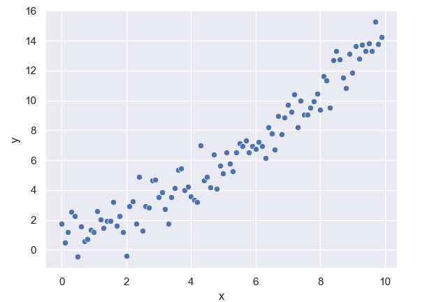
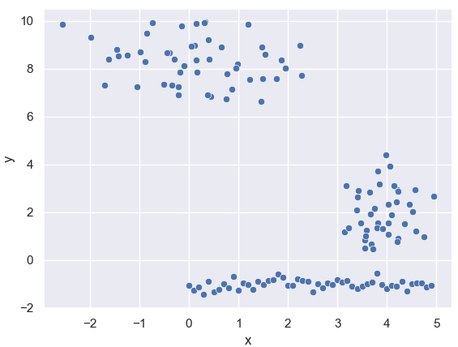
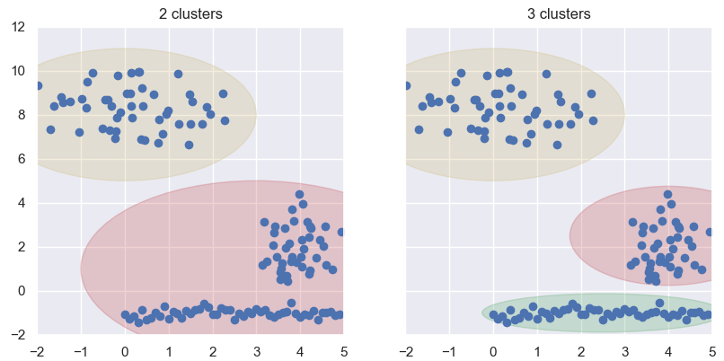
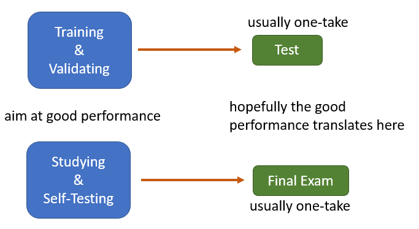

### [Preface](https://ivanmyzou.github.io/TrainValidateTest/index)

## 1. Overview

### 1.1 The Goal of Modelling

Modelling under data-driven machine learning describes the process of building models based on collected data usually of a large volume. The eventual goal is to come up with a model with decent performance. This means that the model performs at a satisfactory level over the data at hand as well as unseen data in the future. Limiting the scope to supervised learning, we would like the model to make predictions by feeding it with inputs and such predictions must resemble actual experience reasonably well (example 1). Though under the context of unsupervised learning, there are no specific predictions task, model performance can be quantified through other means (example 2).

*Example 1:* 
One has collected one-dimensional features *x* and one-dimensional responses *y* (as plotted below) from a sample and the goal is to predict *y* from *x*.

  

The model in the left represented by the red line will be a very poor model as on average its predicted values are far away from the actual observations. On the contrary, the model in the right would be a much better model as it closely resembles actual observations.

  

*Example 2:*
Clustering is a type of unsupervised learning where the model groups given observations into clusters. Say one has collected one-dimensional features *x* as the following, the goal is to group them in a way such that differents groups are far away from each other while within the same group, the points are clustered quite closely together.

  

The clustering model in the right is likely to be preferred over the onw in the left as represented by shaded regions.

  

Bringing back the analogy, model building with given data is similar to a student studying for a final exam with provided study material. We would like the model to perform well both over the data at hand as well as unseen data in the future just like the student trying to perform decently over the given practice questions as a part of the study material and hopefully score well in the final exam where he or she is challenged by unseen questions.

  

### 1.2 Two Components of Modelling

The model building process consists of two main components:
* **model selection**: This component sees the optimal model or model type to be picked out of a pool of candidates, whether picking the best type of model to be trained or selecting the best model from within a type. This former can be data-driven and can be as simple as appointing the type of the model based of prior knowledge. The latter oftern integrates into the process of training and validating.
* **model training**: With a selected type of model, this component adjust the configurations of the model by tuning its parameters so that its performance over the data at hand is reasonbaly optimised.

As mentioned already, the two steps do not necessarily come in chronological order as there are often some back-and-forths while training and validating the model. More details will be explained in [chapter 4](https://ivanmyzou.github.io/TrainValidateTest/chapters/4).

### 1.3 Chronological Overview of Modelling
We here present a chronological overview of the modelling process accompanied by our analogy.

**Modelling**:
1. The modeller is requested to build a prediction model to be used in application. The modeller is granted the freedom to choose modelling approaches as long as he or she can demonstrate strong performance.
2. 

**Studying**:
1. A student enrols in a university level course. The short-term goal is to ace the final exams while the student also would like to applied knowledge learned in real life after the participation in the program. The course is quite complex so that the student may need to develop a set of strategies to solve problems. The rules for final exams are quite relaxed. However, due to limitation of time as well as that no immediate feedback would be given during final exams, the student would need to stick to a chosen set of strategies.
2. 

### 1.4 Training, Validating and Testing
The above section highlights the core spirit of training, validating and testing. 
