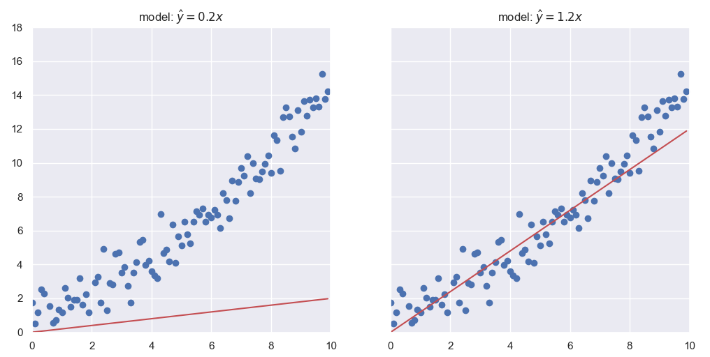

### [Preface](https://ivanmyzou.github.io/TrainValidateTest/index)

## 1. Overview

### 1.1 The Goal of Modelling

Modelling under data-driven machine learning describes the process of building models based on collected data usually of a large volume. The eventual goal is to come up with a model with decent performance. This means that the model performs at a satisfactory level over the data at hand as well as unseen data in the future. Limiting the scope to supervised learning, we would like the model to make predictions by feeding it with inputs and such predictions must resemble actual experience reasonably well (example 1). Though under the context of unsupervised learning, there are no specific predictions task, model performance can be quantified through other means (example 2).

*Example 1:* 
One has collected one-dimensional features *x* and one-dimensional responses *y* (as plotted below) from a sample and the goal is to predict *y* from *x*.

  

The model in the left represented by the red line will be a very poor model as on average its predicted values are far away from the actual observations. On the contrary, the model in the right would be a much better model as it closely resembles actual observations.

  

*Example 2:*
Clustering is a type of unsupervised learning where the model groups given observations into clusters. Say one has collected one-dimensional features *x* as the following, the goal is to group them in a way such that differents groups are far away from each other while within the same group, the points are clustered quite closely together.

  

The clustering model in the right is likely to be preferred over the onw in the left as represented by shaded regions.

  

Bringing back the analogy, model building with given data is similar to a student studying for a final exam with provided study material. We would like the model to perform well both over the data at hand as well as unseen data in the future just like the student trying to perform decently over the given practice questions as a part of the study material and hopefully score well in the final exam where he or she is challenged by unseen questions.

  

### 1.2 Two Components of Modelling

The model building process consists of two main components:
* **model selection**: We clarify the term model and model type (or model class). Model type (or model class) refers to a family of models such as *decision tree models* and *neural network models*. At a lower granularity, we may also refer as an example all trees with depth 2 as a model type. Nevertheless, to avoid confusion, we often address those attributes within a model type such as *decision tree models* as hyperparameters. For example, within *decision tree models*, there can be trees of various structures like the following. We say that there are all decision trees but have different hyperparameters such as depth and maximum number of children per node. 
This component can be further divided into 3 subcompoments. sees the optimal model or model type to be picked out of a pool of candidates, whether picking the best type of model to be trained or selecting the best model from within a type. This former can be data-driven and can be as simple as appointing the type of the model based of prior knowledge. The latter oftern integrates into the process of training and validating.
* **model training**: With a selected type of model, this component adjust the configurations of the model by tuning its parameters so that its performance over the data at hand is reasonbaly optimised.

As mentioned already, the two steps do not necessarily come in chronological order as there are often some back-and-forths while training and validating the model. More details will be explained in [chapter 4](https://ivanmyzou.github.io/TrainValidateTest/chapters/4).

### 1.2 Model Selection

### 1.3 Model Training

### 1.4 Chronological Overview of Modelling
We here present a chronological overview of the modelling process accompanied by our analogy.

**Modelling**:
1. The modeller is requested to build a prediction model to be used in application. The modeller is granted the freedom to choose modelling approaches as long as he or she can demonstrate strong performance.
2. The modeller comes up with a list of different model types perhaps that the list includes *linear regression models*, *decision trees* and *plain neural network models*. He or she may already have a preference based on prior knowledge.
3. Some intial model training is carried out over models of different types. The performances of different types of models are validated and the modeller would conclude the model types to focus on.
4. With the selected model type, the modeller focuses on training the model. Throughout the training phase, validation is carried out to check whether there are overfittings.
5. After some training and validating, the modeller chooses a trained model to be tested. The test is only one-take over one model. 
6. If the model performs well enough in the test, the modeller can present the model to stakeholders and prepare to deploy it in production. Otherwise, the modeller would return to the previous exercise repeating at least most of step 3 onwards.  

**Studying**:
1. A student enrols in a university course. The short-term goal is to ace the final exams while the student also would like to apply knowledge learned in real life. The course is quite complex so that the student may need to develop a set of strategies to solve problems. The rules for final exams are quite relaxed. However, due to limitation of time as well as that no immediate feedback would be given during final exams, the student needs to stick to a chosen set of strategies.
2. The student lists down a set of different problem-solving strategies. For example, maybe he or she needs to judge for the task of estimating some random variables, whether is to embrace the probabilistic approach of deriving the expectations or to estimate empirically by running Monte Carlo simulations. 
3. With different set of strategies, the student attempts questions and then compare with sample answers, improving its methodology under each strategy over time. The student then attempts a few mock exams so that he or she can focus on a set of strategies for further development.
4. Under the chosen set of strategies, the student studies by going through many questions and learn by referring to the sample answer. He or she may revisit the same question after a while, endeavouring to deliver better responses. The student also attempts mock exams from time to time in order to ensure that he or she does not merely remembers the sample answers. The student would like to learn the knowledge by heart so that decent responses can be provided to mock exams with different questions but testing on same concepts.
5. After many rounds of studying and self-testing, the student takes the final exam which is one-take only.
6. If the student scores adequately, he or she will complete the course and relevant qualifications will be benefitial in landing position where learned knowledge can be applied. Otherwise, the student shall enrol again, repeating at least most of step 3 onwards. 

### 1.5 Training, Validating and Testing
The above section highlights the core spirit of training, validating and testing.

For a student, questions in the final exams are almost guaranteed to be unseen. In addition, the best practice for taking mock exams is to self-test over questions not seen in regular studies or at the very least those not encountered in recent studies. Likewise, in modelling, we would like to have a data set reserved (held out) for testing only and it should never be used in training. This data set is the test set (or test data set) and sometimes referred to as holdout data set. Similarly, it would be a good practice to have separated and mutually exclusive training set (or training data set) and validation set (or validation data set) for the purpose of training and validation.
