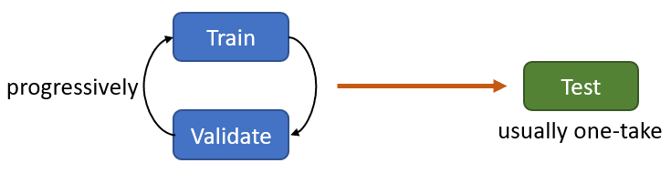
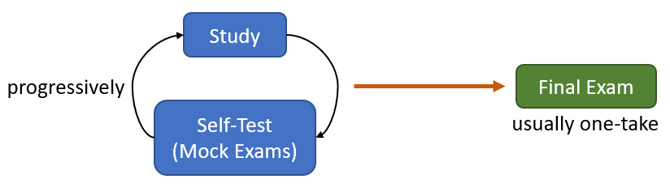

<!--- # An Illustrative Guide to Training, Validating and Testing in Modelling -->

A large part of data-driven machine learning is to do with modelling training where the model parameters are progressively updated with optimisation algorithms so that the model progressively improves as reflected through some performance criteria. Closely related to model training, validating and testing also play a huge role in ensuring the model may generalise its performance to relevant scenarios outside of training. Failing to understand those concepts poses substantial risks in understanding the model performance. This then leads to diminished benefit from applying models.

  

As an analogy, a modeller training a model is similar to a student studying for exams. The goal of training a model is to apply it in making a prediction or in a more general sense producing some insights regarding the matter at hand. Similarly, a student studies in aim of performing well in exams and perhaps becoming capable of applying the contents learned in real life. Like model training, a student learn contents by correcting mistakes and updating his or her interpretations. Model validation on the other hand is comparable to the student taking mock exams to validate how well the contents have been learned. Model testing at the end is like a final exam at the end where completely unseen questions are used to assess how well the student is performing.

  

## Contents

### 1. [Overview](https://ivanmyzou.github.io/TrainValidateTest/chapters/1)
We present a short overview of common modelling practices. We introduce the concepts of training, validating and testing as well as the data splitting under the context of modelling.
### 2. [Model Training](https://ivanmyzou.github.io/TrainValidateTest/chapters/2)
We explain what happens during model training and what a minimal model training procedure entails, introducing the related and very important concepts of underfitting and overfitting.
### 3. [Model Testing](https://ivanmyzou.github.io/TrainValidateTest/chapters/3)
We describe the need for model testing and how that assists modellers in addressing the problems of underfitting and overfitting arise from model training. We explain how model testing aims to address the issues in model training.
### 4. [Model Validations](https://ivanmyzou.github.io/TrainValidateTest/chapters/4)
We clarify why model validations are usually performed during training. Model validations seemingly fulfill the role of model testing in a redundant manner but it is indeed different and must be separated from the testing procedure which takes place at the very end.
### 5. [Common Modelling Workflow](https://ivanmyzou.github.io/TrainValidateTest/chapters/5)
We summarise the common modelling workflow, providing a general picture of what the normal science entails in the relevant field. We loop back to the concepts introduced in earlier chapters. 
